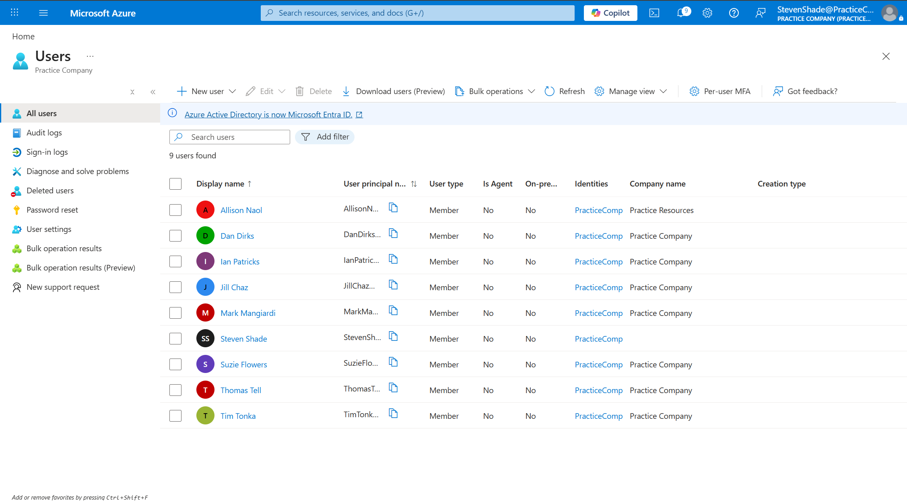

# Phase 1: Identity, Access Control, and Governance

## Business Scenario
`Practice Company` is a tech startup that focuses on automated inventory tracking for local retailers. To support operations, the Azure tenant will have four separate departments utilizing different groups and Administrative Units: IT & Security, Finance, Human Resources, and Engineering. 

## Step-by-Step Implementation
### Step 1: Add Users
Each department in the 'Practice Company' has hired a department head and 1-2 new employees. All employees were created and added to the Entra ID directory. 

*Figure 1: Verified roster provisioned within the Practice Company tenant directory.*

### Step 2: Groups and Administrative Units
To avoid managing individual accounts, all employees were organized into appropriate security groups (e.g., `IT-Staff-Group`, `HR-Staff-Group`). To reduce creation time, users were auto-assigned into each group using dynamic memberships. 

*Figure 2: Formed dynamic membership groups to automate member type.*

The basic dynamic membership rules syntax used to populate each group:
* **Engineering:** `(user.department -eq "Engineering")`
* **Finance:** `(user.department -eq "Finance")`
* **Human Resources**: `(user.department -eq "Human Resources")`
* **IT & Security:** `(user.department -eq "IT & Security")`

Administrative boundaries were set by implementing Administrative Units (AU). Each security group that was created was then managed by a specific AU. For example, the `IT-Department-AU` was created and houses the `IT-Staff-Group`. 

*Figure 3: Administrative Units to establish boundaries between departments.*

The Director of each group was then assigned the *User Administrator* role scoped to the AU, allowing the Director to have administrator control over their team and preventing the Director from accessing the other departments.

*Figure 4: A **User Administrator** role was assigned to each Director in their respective AU (in this case, Allison Naol), granting them privileges over the groups that are assigned to the AU.*

### Step 3: Governance
`Practice Company` administration has determined that each department in the company will need their own resource group, and that the company is currently only allowed to make virtual machines that are located in the East US. Administration is also requiring that all resource groups have tags listing the department. Before creating the resource groups and resources, safeguards were added to the company through policies and initiatives. The following three policies were added to meet the administration's requirements:

* **Custom - Allowed Resources:** Only allows the company to create virtual machines.
* **Custom - Allowed Locations for Resources:** Only allows the company to create resources in the East US location.
* **Require a Tag on Resource Groups:** All resource groups require a tag listing their department.

Once these three policies were created, they were added to an initiative called `Practice Company Primary Governance`:

*Figure 5: An initiative holding the three policies that were created to meet the administration's requirements.*

### Step 4: Resource Groups and Compliance Check
Each department in the `Practice Company` is needing a resource group to hold all of their virtual machines. To test the validity of the initiative, a resource group was created without a tag to ensure that an error would be thrown:

*Figure 6: Testing the "require a tag" policy within the initiative.*

Since the initiative is working, a resource group was created for each department and included the appropriate tag:

*Figure 7: All of the resource groups created for each department within the `Practice Company`.*

As a final check to ensure that the initiative is working, the compliance tab was checked to see if any groups failed the compliance check:

*Figure 8: Confirmation that the `Practice Company Primary Governance` initiative is applied and working.*

### Step 5: Budget
Company administration has also required that the company only have a monthly budget of $100 and that the director of finance should receive a notification when 85% of the monthly budget is spent. A budget called `Monthly_Budget` was created to set a budget of $100, and an **Actual Cost** alert condition was set to trigger when 85% of the monthly budget was spent. Finally, Jill Chaz, the Director of Finance, was set to receive an email when the 85% budget threshold was met: 

*Figure 9: A budget created for the `Practice Company`, including requirements given by the administration.*
 
