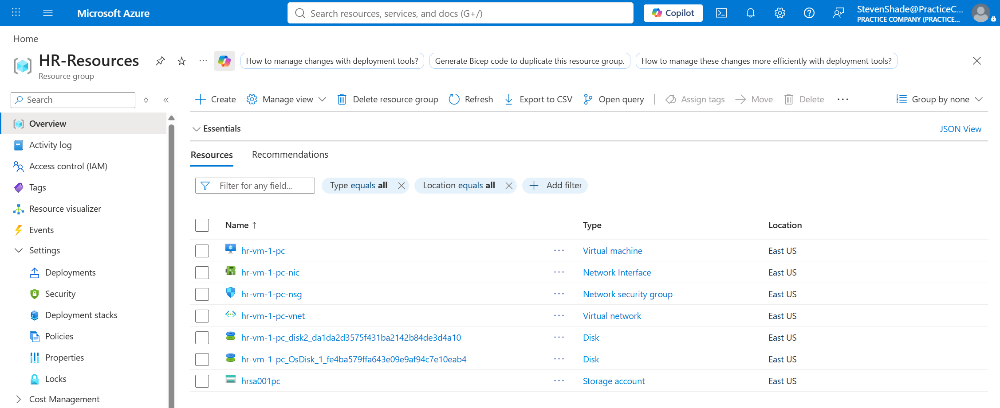
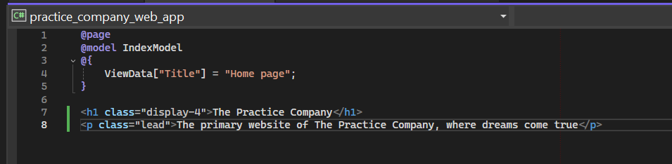
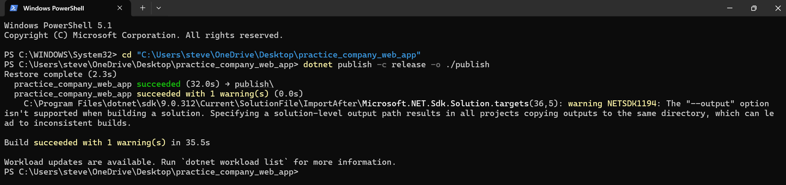
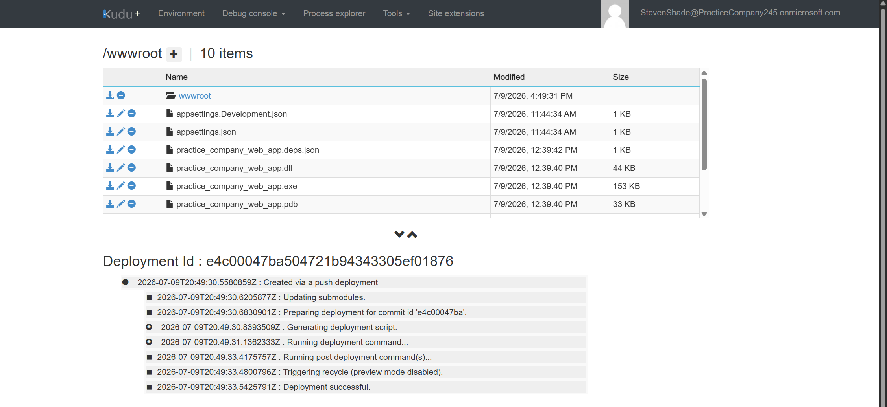
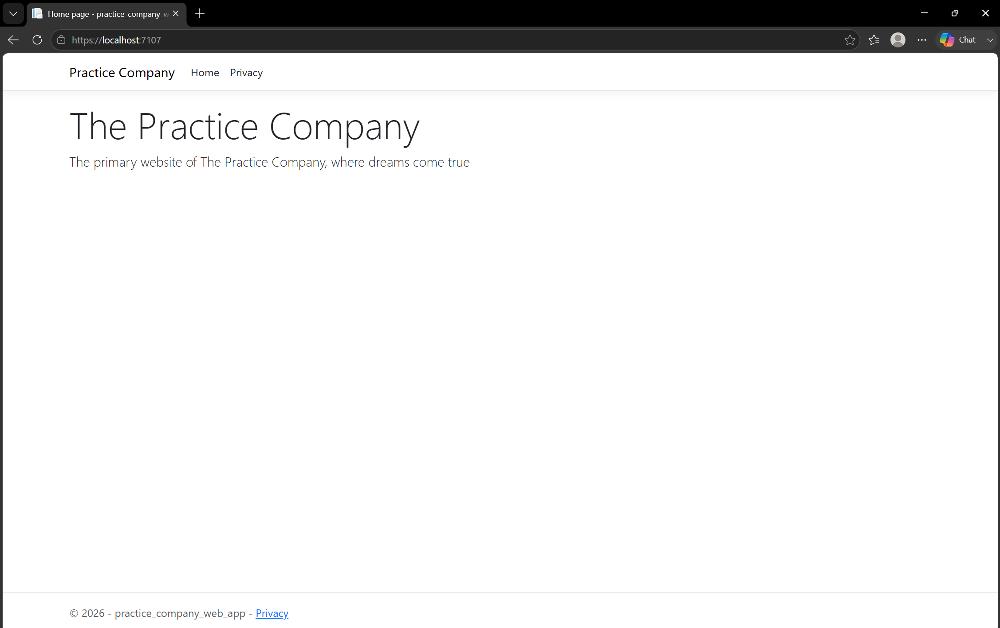

# Phase 3: Implement Compute Resources

## Business Scenario
`Practice Company` needs Microsoft virtual machines deployed to department resource groups. There is also need for a company website to be hosted through an Azure Web App.  

## Step-by-Step Implementation
### Step 1: Automated Virtual Machine (Bicep)
`Practice Company` needs a Microsoft virtual machine deployed to the HR department. There are specific requirements for the VM: 
* The VM needs to be the `2022-datacenter-azure-edition` OS.
* A standard, basic model is suitable for the VM.

At some point, other departments will need this same VM deployed to their resource group. To ensure a consistent deployment, a `bicep` file was used to create the template for the VM. VS Code was used to create the Bicep file after installing the appropriate extensions. We will need the name of the VM, the admin username, and the password. Aside from the password, the values will be hardcoded.

```bicep
@description('Name of the VM specifically allocated to the HR department')
param vmName string = 'hr-vm-1-pc'

@description('The HR-specific username for the VM')
param adminUsername string = 'hr-user-vm'

@description('VM Password')
param adminPassword string
```
*Figure 1: The bicep file establishing the fundamental values: `vmName`, `adminUsername`, and `adminPassword`.*

The company only wants VMs to be deployed as `2022-datacenter-azure-edition`, and some other operating systems may be implemented in the future. An `@allowed` list is created to list the VMs that the company is willing to create. The required OS, `2022-datacenter-azure-edition`, is then assigned to the variable `OSVersion` to be used for reference later. The `Standard_D2s_v4` was selected to utilize a cost-effective, basic VM size.

```bicep
@description('Company only allows 2022 Microsoft VMs')
@allowed([
  '2022-datacenter-azure-edition'
  '2022-datacenter-core-g2'
  '2022-datacenter-core-smalldisk-g2'
  '2022-datacenter-g2'
  '2022-datacenter-smalldisk-g2'
])
param OSVersion string = '2022-datacenter-azure-edition'

@description('The size used for the VM')
param vmSize string = 'Standard_D2s_v4'

@description('Location pulled from RG entered during deployment')
param location string = resourceGroup().location

param securityType string = 'TrustedLaunch'
```
*Figure 2: Additional parameters are set for the VM to be deployed.*

A `networkConfig` variable was created to store variety of networking variables in clean syntax. Where appropriate, string interpolation is used for code maintainability and to reduce the risk of errors that may result from hardcoding the values. 

```bicep
var networkConfig = {
  nicName: '${vmName}-nic'
  subnetName: '${vmName}-subnet'
  virtualNetworkName: '${vmName}-vnet'
  networkSecurityGroupName: '${vmName}-nsg'
  addressPrefix: '10.0.0.0/16'
  subnetPrefix: '10.0.0.0/24'
}
```
*Figure 3: The `networkConfig` variable storing a variety of information that will be referenced later using dot syntax.*

Next, the NSG, VNet, and NIC were created for the VM. Dot syntax was frequently used to assign values to networking variables, such as in the NSG resource:

```bicep
resource networkSecurityGroup 'Microsoft.Network/networkSecurityGroups@2022-05-01' = {
  name: networkConfig.networkSecurityGroupName
  location: location
}
```
*Figure 4: Dot syntax being utilized to assign values to a NSG variable.*

With all parameters and variables set, the VM can now be created.

```bicep

resource vm 'Microsoft.Compute/virtualMachines@2022-03-01' = {
  name: vmName
  location: location
  properties: {
    hardwareProfile: {
      vmSize: vmSize
    }
    securityProfile: {
      securityType: securityType
      uefiSettings: {
        secureBootEnabled: true
        vTpmEnabled: true
      }
    }
    osProfile: {
      computerName: vmName
      adminUsername: adminUsername
      adminPassword: adminPassword
    }
...
```
*Figure 5: A code segment that shows the creation of the VM.*

To deploy the VM, a PowerShell session was used to locate and execute the bicep file.

```powershell
Connect-AzAccount

New-AzResourceGroupDeployment `
  -ResourceGroupName "HR-Resource" `
  -TemplateFile "<file location>"
```
*Figure 6: The PS code to execute the bicep file.*

After the code executes, looking back into the HR-Resources resource group shows the VM, as well as the NSG, NIC, VNet, and disks.


*Figure 7: The VM and all other resources successfully deployed to the HR resource group.*

The bicep script used to deploy this VM can be found here: [main.bicep](./images/main.bicep)

### Step 2: Company Website hosted in Azure
One of the company's C# developers will be creating a website using **ASP.NET** and **Razor pages**. Once finished, this website needs to be hosted on Azure. Doing so follows a simple procedure:
* Create the infrastructure needed to host the web app by allocating an **Azure App Service Plan**.
* Create an **Azure Web App** to hold the C# code that created the website.
* Test the framework with a simple website created through ASP.NET/Razor pages to ensure the infrastructure will work as intended
* Implement the actual company website created by the C# developer.

To start, very basic C# code was created using ASP.NET and HTML to have a website display some basic text.


*Figure 8: Basic C# code to create a website that will be used to test the Azure App Service infrastructure.*

Next, a PowerShell command is used to package up all of the contents of the web app that will later be uploaded to the web app service. 


*Figure 9: The PowerShell script used to package up the basic C# web app that will be hosted in the Azure web app.*

All of the published code was zipped up into a compressed file. This zipped folder was uploaded into `Kudu` 


*Figure 10: The web app .zip folder being uploaded into **Kudu**, allowing the website to deploy and be visible through the Azure Web App.*

Once the .zip folder finished uploading to **Kudu**, the website is ready to test. Clicking the default domain link in the web app takes us to the test website, and everything is displaying as intended.


*Figure 11: Confirmation that the web app service is working as intended, and the website is appropriately hosted.*
